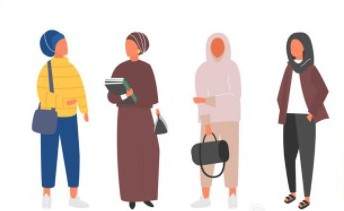
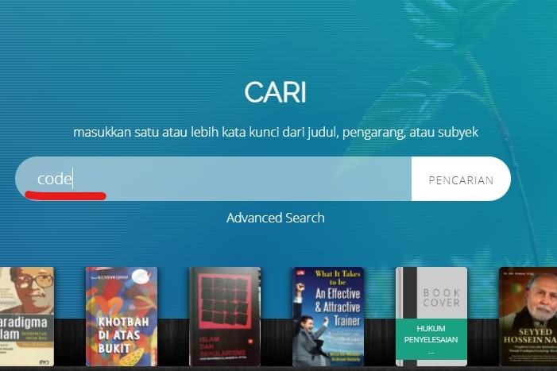
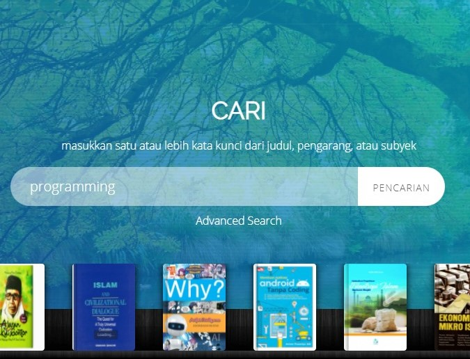
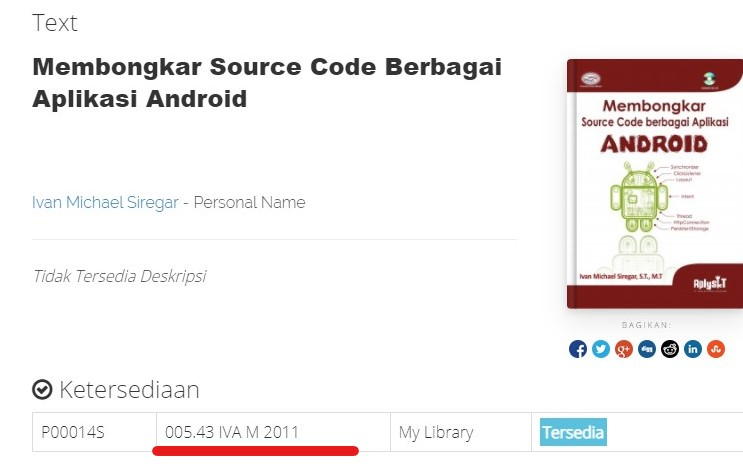

<!DOCTYPE html>
<html lang="en">
    <head>
        <meta charset="utf-8" />
        <meta name="viewport" content="width=device-width, initial-scale=1, shrink-to-fit=no" />
        <meta name="description" content="" />
        <meta name="author" content="" />
        <title>Library Visitor</title>
        <!-- Favicon-->
        <link rel="icon" type="image/x-icon" href="assets/favicon.ico" />
        <!-- Font Awesome icons (free version)-->
        
        <!-- Google fonts-->
        <link href="https://fonts.googleapis.com/css?family=Montserrat:400,700" rel="stylesheet" type="text/css" />
        <link href="https://fonts.googleapis.com/css?family=Roboto+Slab:400,100,300,700" rel="stylesheet" type="text/css" />
        <!-- Core theme CSS (includes Bootstrap)-->
        <link href="css/styles.css" rel="stylesheet" />
    </head>
    <body id="page-top">
        <!-- Navigation-->
        <nav class="navbar navbar-expand-lg navbar-dark fixed-top" id="mainNav">
            

                
                <button class="navbar-toggler" type="button" data-bs-toggle="collapse" data-bs-target="#navbarResponsive" aria-controls="navbarResponsive" aria-expanded="false" aria-label="Toggle navigation">
                    Menu
                    <i class="fas fa-bars ms-1"></i>
                </button>
                

                    <ul class="navbar-nav text-uppercase ms-auto py-4 py-lg-0">
                        <li class="nav-item"><a class="nav-link" href="#services">Library Visitor</a></li>
                        <li class="nav-item"><a class="nav-link" href="#portfolio">Your Step</a></li>
                        <li class="nav-item"><a class="nav-link" href="#about">About</a></li>
                        <li class="nav-item"><a class="nav-link" href="#team">Search</a></li>
                        <!--<li class="nav-item"><a class="nav-link" href="#contact">Contact</a></li>-->
                    </ul>
                

            

        </nav>
        <!-- Masthead-->
        <header class="masthead">
            

                
Welcome To Our Library!

                
It's Nice To Meet You

                <a class="btn btn-primary btn-xl text-uppercase" href="#services">Fill your personal data to visit the library</a>
            

        </header>
        <!-- Services-->
        <html>
<head>

</head>
</html>
        <section class="page-section" id="services">
            

                

                    <h2 class="section-heading text-uppercase">Library Visitor</h2>
                    <h3 class="section-subheading text-muted">Fill your personal data to visit the library</h3>
                    <form action="" method="post">
	<table class="table" >

	<tr>
			<td>NIM</td>
			
			<td>
				<input class="form-control" type="text" name="NIM" placeholder="enter your NIM" size="20">
			</td>
		</tr>
		
		<tr>
			<td>Visitor Name</td>
			
			<td>
				<input class="form-control" type="text" name="nama" placeholder="enter your name" size="40">
			</td>
		</tr>
		<tr>
			
		</tr>
		<tr>
			<td>Major</td>
			
			<td>
				<select class='form-control' name='Prodi'> 
					<option value='' selected>Major</option>
					<option>Pendidikan Agama Islam</option>
					<option>Pendidikan Bahasa Arab</option>
					<option>Tadris Bahasa Inggris</option>
					<option>Ilmu Qur'an dan Tafsir</option>
					<option>Hukum Ekonomi Syariah</option>
					<option>Perbandingan Madzhab</option>
					<option>Ekonomi Islam</option>
					<option>Manajemen Bisnis</option>
					<option>Gizi</option>
					<option>Farmasi</option>
					<option>Hubungan Internasional</option>
					<option>Ilmu Komunikasi</option>
					<option>Teknik Informatika</option>
					<option>Agroteknologi</option>
					<option>Matrikulasi</option>
				</select>
			</td>
		</tr>
		<tr>
			<td>Semester</td>
			
			<td>
				<select class='form-control' name='semester'> 
					<option value='' selected>Semester</option>
					<option>MARTIKULASI</option>
					<option>1</option>
					<option>2</option>
					<option>3</option>
					<option>4</option>
					<option>5</option>
					<option>6</option>
					<option>7</option>
					<option>8</option>
					<option>9+</option>
				</select>
			</td>
		<tr>
            <td> </td>
		    <td><button class="btn btn-primary btn-xl text-uppercase" type="submit" name="tambah">Save</button> </td>
		</tr>
	</table>
</form>
<?php 
 if (isset($_POST['tambah'])){
 	include 'koneksi.php';
	$NIM  = htmlspecialchars(strtolower($_POST['NIM']));
 	$nama    = htmlspecialchars(strtolower($_POST['nama']));
 	$semester = htmlspecialchars(strtolower($_POST['semester']));
 	$Prodi = htmlspecialchars(strtolower($_POST['Prodi']));
 	

 	if ($NIM == '' || $nama == '' || $semester =='' || $Prodi ==''){
 		echo "
 		
 		";
 	}else {
 		$today = '20' . sprintf(date('y-m-d'));
 		$tglkunjung = $today;

 		$simpan = mysqli_query($konek , "INSERT INTO tamu VALUES (null, '$NIM', '$nama','$semester', '$Prodi' ,'$tglkunjung')
 			");
 		if ($simpan){
 			echo "
 		
 		";
 		}else {
 			echo "
 		
 		";
 		}
 	}
 }

 ?>
        
                

            

        </section>
        <!-- Portfolio Grid-->
        <section class="page-section bg-light" id="portfolio">
            

                

                    <h2 class="section-heading text-uppercase">Library Visit Steps</h2>
                    <h3 class="section-subheading text-muted">how to visit the library</h3>
                

                

                    

                        <!-- Portfolio item 1-->
                        

                            <a>
                                

                                    
<i></i>

                                

                                
                            </a>
                            

                                
Library Visitor

                                
Mengisi data diri anda sebagai pengunjung di Perpustakaan

                            

                        

                    

                    

                        <!-- Portfolio item 2-->
                        

                            <a>
                                

                                    
<i></i>

                                

                                
                            </a>
                            

                                
Put the Bag

                                
Meletakkan tas kedalam box yang disediakan, dilarang membawa tas ke dalam ruang baca.

                            

                        

                    

                    

                        <!-- Portfolio item 3-->
                        

                            <a>
                                

                                    
<i></i>

                                

                                
                            </a>
                            

                                
Search the Book

                                
Mencari buku yang di inginkan melalui PC yang telah di sediakan, 
                                    atau dengan masuk ke url berikut <a href="http://192.168.100.151/inspirationlibrary">http://192.168.100.151/inspirationlibrary</a>

                            

                        

                    

                    

                        <!-- Portfolio item 4-->
                        

                            <a>
                                

                                    
<i></i>

                                

                                
                            </a>
                            

                                
Reading

                                
Membaca buku yan telah di pilih

                            

                        

                    

                    

                        <!-- Portfolio item 5-->
                        

                            <a>
                                

                                    
<i></i>

                                

                                
                            </a>
                            

                                
Return the Book

                                
Mengembalikan buku ke dalam box yang telah disediakan.

                            

                        

                    

                    

                        <!-- Portfolio item 6-->
                        

                            <a>
                                

                                    
<i></i>

                                

                                
                            </a>
                            

                                
Exit

                                
Keluar dari perpustakaan dengan tidak meninggalkan barang apapun.

                            

                        

                    

                

            

        </section>
        <!-- About-->
        <section class="page-section" id="about">
            

                

                    <h2 class="section-heading text-uppercase">About</h2>
                    <h3 class="section-subheading text-muted">Library of University of Darussalam Gontor</h3>
                

                <ul class="timeline">
                    <li>
                        

                        

                            

                                <!--<h4>About</h4>-->
                                <h4 class="subheading">Library</h4>
                            

                            

Perpustakaan merupakan wajah utama kampus
                                 sebagai gudang ilmu. Untuk itu UNIDA Gontor selalu berupaya memperbaiki fasilitas perpustakaan
                                 agar mahasiswa merasa nyaman berada di perpustakaan.

                        

                    </li>
                    <li class="timeline-inverted">
                        

                        

                            

                               <!-- <h4>Collection</h4>-->
                                <h4 class="subheading">Collection</h4>
                            

                            

 Koleksi yang dimiliki Perpustakaan UNIDA Gontor saat ini telah mencapai kurang lebih 5000 eksemplar buku dan insyaallah akan terus bertambah sesuai dengan kebutuhan para dosen dan mahasiswi.

                        

                    </li>
                    <!--  <li>
                      

                        

                            

                                <h4>December 2015</h4>
                                <h4 class="subheading">Transition to Full Service</h4>
                            

                            

Lorem ipsum dolor sit amet, consectetur adipisicing elit. Sunt ut voluptatum eius sapiente, totam reiciendis temporibus qui quibusdam, recusandae sit vero unde, sed, incidunt et ea quo dolore laudantium consectetur!

                        

                    </li>
                    <li class="timeline-inverted">
                        

                        

                            

                                <h4>July 2020</h4>
                                <h4 class="subheading">Phase Two Expansion</h4>
                            

                            

Lorem ipsum dolor sit amet, consectetur adipisicing elit. Sunt ut voluptatum eius sapiente, totam reiciendis temporibus qui quibusdam, recusandae sit vero unde, sed, incidunt et ea quo dolore laudantium consectetur!

                        

                    </li> -->
                    <li class="timeline-inverted">
                        

                            <h4>
                                Be Part
                                 
                                Of Our
                                 
                                Story!
                            </h4>
                        

                    </li>
                </ul>
            

        </section>
        <!-- Team-->
        <section class="page-section bg-light" id="team">
            

                

                    <h2 class="section-heading text-uppercase">How to Search Your Own Book</h2>
                    <h3 class="section-subheading text-muted">Berikut langkah-langkah untuk mencari buku yang anda inginkan</h3>
                

                

                    

                    
                        

                           <!-- -->
                            <h4>Pencarian Keyword</h4>
                            
gunakan link 
                            <a href="http://192.168.100.151/inspirationlibrary">http://192.168.100.151/inspirationlibrary</a>
                                lalu masukkan keyword buku yang ingin dicari

                            
                        

                    

                    

                    
                        

                            <h4>Kode Buku</h4>
                            
Setelah buku yang dicari telah ditemukan, perhatikanlah kode yang ada untuk mencari buku di rak perpustakaan

                           
                        

                    

                    

                    
                        

                            <h4>Pencarian Buku</h4>
                            
Kode buku yang telah didapatkan digunakan untuk mencari buku di dalam rak, di setiap rak telah ditandai dengan nomor dan warna yang berbeda, sesuai dengan jenis buku

                            
                        

                    

                

                

                    

dimohon untuk tidak mengembalikan buku ke rak buku, dan mengembalikannya kedalam tempat yang telah disediakan

                

            

        </section>
        <!-- Clients-->
        

            

                

                    

                        
                    

                    

                        
                    

                    

                        
                    

                    

                        
                    

                

            

        

        <!-- Contact-->
        <section class="page-section" id="contact">
            

                

                    <h2 class="section-heading text-uppercase">Contact Us</h2>
                    <h3 class="section-subheading text-muted">Find Us</h3>
                    <h3 class="section-subheading "><a href="https://library.unida.gontor.ac.id/y">https://library.unida.gontor.ac.id/</a></h3>
                    <h3 class="section-heading text-uppercase">perpusputri@unida.gontor.ac.id</h3>
                    
                

                <!-- * * * * * * * * * * * * * * *-->
                <!-- * * SB Forms Contact Form * *-->
                <!-- * * * * * * * * * * * * * * *-->
                <!-- This form is pre-integrated with SB Forms.-->
                <!-- To make this form functional, sign up at-->
                <!-- https://startbootstrap.com/solution/contact-forms-->
                <!-- to get an API token!-->
                <!--<form id="contactForm" data-sb-form-api-token="API_TOKEN">
                    

                        

                            
-->
                                <!-- Name input-->
                                <!--<input class="form-control" id="name" type="text" placeholder="Your Name *" data-sb-validations="required" />
                                
A name is required.

                            

                            
-->
                                <!-- Email address input-->
                                <!-- <input class="form-control" id="email" type="email" placeholder="Your Email *" data-sb-validations="required,email" />
                                
An email is required.

                                
Email is not valid.

                            

                            
-->
                                <!-- Phone number input-->
                               <!--  <input class="form-control" id="phone" type="tel" placeholder="Your Phone *" data-sb-validations="required" />
                                
A phone number is required.

                            

                        

                        

                            
-->
                                <!-- Message input-->
                               <!-- <textarea class="form-control" id="message" placeholder="Your Message *" data-sb-validations="required"></textarea>
                                
A message is required.

                            

                        

                    
-->
                    <!-- Submit success message-->
                    <!---->
                    <!-- This is what your users will see when the form-->
                    <!-- has successfully submitted-->
                 <!--    

                        

                            
Form submission successful!

                            To activate this form, sign up at
                             
                            <a href="https://startbootstrap.com/solution/contact-forms">https://startbootstrap.com/solution/contact-forms</a>
                        

                    
-->
                    <!-- Submit error message-->
                    <!---->
                    <!-- This is what your users will see when there is-->
                    <!-- an error submitting the form-->
                  <!--  

                      
Error sending message!

-->
                    <!-- Submit Button-->
                   <!--  
<button class="btn btn-primary btn-xl text-uppercase disabled" id="submitButton" type="submit">Send Message</button>

                </form>
            

        </section>-->
        <!-- Footer-->
        <footer class="footer py-4">
            

                

                <html>
<head>

</head>
</html>
                    

                    <h8>
      Copyright &copy;
      Library of University of Darussalam Gontor Female Campus 2021
    </h8> 

                        <!--<a class="btn btn-dark btn-social mx-2" href="#!"><i class="fab fa-twitter"></i></a>
                        <a class="btn btn-dark btn-social mx-2" href="#!"><i class="fab fa-facebook-f"></i></a>
                        <a class="btn btn-dark btn-social mx-2" href="#!"><i class="fab fa-linkedin-in"></i></a>-->
                    

                   
                

            

        </footer>
        <!-- Portfolio Modals-->
        <!-- Portfolio item 1 modal popup-->
        

            

                

                    

                    

                        

                            

                                

                                    <!-- Project details-->
                                    <h2 class="text-uppercase">Project Name</h2>
                                    
Lorem ipsum dolor sit amet consectetur.

                                    
                                    
Use this area to describe your project. Lorem ipsum dolor sit amet, consectetur adipisicing elit. Est blanditiis dolorem culpa incidunt minus dignissimos deserunt repellat aperiam quasi sunt officia expedita beatae cupiditate, maiores repudiandae, nostrum, reiciendis facere nemo!

                                    <ul class="list-inline">
                                        <li>
                                            <strong>Client:</strong>
                                            Threads
                                        </li>
                                        <li>
                                            <strong>Category:</strong>
                                            Illustration
                                        </li>
                                    </ul>
                                    <button class="btn btn-primary btn-xl text-uppercase" data-bs-dismiss="modal" type="button">
                                        <i class="fas fa-times me-1"></i>
                                        Close Project
                                    </button>
                                

                            

                        

                    

                

            

        

        <!-- Portfolio item 2 modal popup-->
        

            

                

                    

                    

                        

                            

                                

                                    <!-- Project details-->
                                    <h2 class="text-uppercase">Project Name</h2>
                                    
Lorem ipsum dolor sit amet consectetur.

                                    
                                    
Use this area to describe your project. Lorem ipsum dolor sit amet, consectetur adipisicing elit. Est blanditiis dolorem culpa incidunt minus dignissimos deserunt repellat aperiam quasi sunt officia expedita beatae cupiditate, maiores repudiandae, nostrum, reiciendis facere nemo!

                                    <ul class="list-inline">
                                        <li>
                                            <strong>Client:</strong>
                                            Explore
                                        </li>
                                        <li>
                                            <strong>Category:</strong>
                                            Graphic Design
                                        </li>
                                    </ul>
                                    <button class="btn btn-primary btn-xl text-uppercase" data-bs-dismiss="modal" type="button">
                                        <i class="fas fa-times me-1"></i>
                                        Close Project
                                    </button>
                                

                            

                        

                    

                

            

        

        <!-- Portfolio item 3 modal popup-->
        

            

                

                    

                    

                        

                            

                                

                                    <!-- Project details-->
                                    <h2 class="text-uppercase">Project Name</h2>
                                    
Lorem ipsum dolor sit amet consectetur.

                                    
                                    
Use this area to describe your project. Lorem ipsum dolor sit amet, consectetur adipisicing elit. Est blanditiis dolorem culpa incidunt minus dignissimos deserunt repellat aperiam quasi sunt officia expedita beatae cupiditate, maiores repudiandae, nostrum, reiciendis facere nemo!

                                    <ul class="list-inline">
                                        <li>
                                            <strong>Client:</strong>
                                            Finish
                                        </li>
                                        <li>
                                            <strong>Category:</strong>
                                            Identity
                                        </li>
                                    </ul>
                                    <button class="btn btn-primary btn-xl text-uppercase" data-bs-dismiss="modal" type="button">
                                        <i class="fas fa-times me-1"></i>
                                        Close Project
                                    </button>
                                

                            

                        

                    

                

            

        

        <!-- Portfolio item 4 modal popup-->
        

            

                

                    

                    

                        

                            

                                

                                    <!-- Project details-->
                                    <h2 class="text-uppercase">Project Name</h2>
                                    
Lorem ipsum dolor sit amet consectetur.

                                    
                                    
Use this area to describe your project. Lorem ipsum dolor sit amet, consectetur adipisicing elit. Est blanditiis dolorem culpa incidunt minus dignissimos deserunt repellat aperiam quasi sunt officia expedita beatae cupiditate, maiores repudiandae, nostrum, reiciendis facere nemo!

                                    <ul class="list-inline">
                                        <li>
                                            <strong>Client:</strong>
                                            Lines
                                        </li>
                                        <li>
                                            <strong>Category:</strong>
                                            Branding
                                        </li>
                                    </ul>
                                    <button class="btn btn-primary btn-xl text-uppercase" data-bs-dismiss="modal" type="button">
                                        <i class="fas fa-times me-1"></i>
                                        Close Project
                                    </button>
                                

                            

                        

                    

                

            

        

        <!-- Portfolio item 5 modal popup-->
        

            

                

                    

                    

                        

                            

                                

                                    <!-- Project details-->
                                    <h2 class="text-uppercase">Project Name</h2>
                                    
Lorem ipsum dolor sit amet consectetur.

                                    
                                    
Use this area to describe your project. Lorem ipsum dolor sit amet, consectetur adipisicing elit. Est blanditiis dolorem culpa incidunt minus dignissimos deserunt repellat aperiam quasi sunt officia expedita beatae cupiditate, maiores repudiandae, nostrum, reiciendis facere nemo!

                                    <ul class="list-inline">
                                        <li>
                                            <strong>Client:</strong>
                                            Southwest
                                        </li>
                                        <li>
                                            <strong>Category:</strong>
                                            Website Design
                                        </li>
                                    </ul>
                                    <button class="btn btn-primary btn-xl text-uppercase" data-bs-dismiss="modal" type="button">
                                        <i class="fas fa-times me-1"></i>
                                        Close Project
                                    </button>
                                

                            

                        

                    

                

            

        

        <!-- Portfolio item 6 modal popup-->
        

            

                

                    

                    

                        

                            

                                

                                    <!-- Project details-->
                                    <h2 class="text-uppercase">Project Name</h2>
                                    
Lorem ipsum dolor sit amet consectetur.

                                    
                                    
Use this area to describe your project. Lorem ipsum dolor sit amet, consectetur adipisicing elit. Est blanditiis dolorem culpa incidunt minus dignissimos deserunt repellat aperiam quasi sunt officia expedita beatae cupiditate, maiores repudiandae, nostrum, reiciendis facere nemo!

                                    <ul class="list-inline">
                                        <li>
                                            <strong>Client:</strong>
                                            Window
                                        </li>
                                        <li>
                                            <strong>Category:</strong>
                                            Photography
                                        </li>
                                    </ul>
                                    <button class="btn btn-primary btn-xl text-uppercase" data-bs-dismiss="modal" type="button">
                                        <i class="fas fa-times me-1"></i>
                                        Close Project
                                    </button>
                                

                            

                        

                    

                

            

        

        <!-- Bootstrap core JS-->
        
        <!-- Core theme JS-->
        
        <!-- * * * * * * * * * * * * * * * * * * * * * * * * * * * * * * * * * * * * * * * *-->
        <!-- * *                               SB Forms JS                               * *-->
        <!-- * * Activate your form at https://startbootstrap.com/solution/contact-forms * *-->
        <!-- * * * * * * * * * * * * * * * * * * * * * * * * * * * * * * * * * * * * * * * *-->
        
    </body>
</html>
